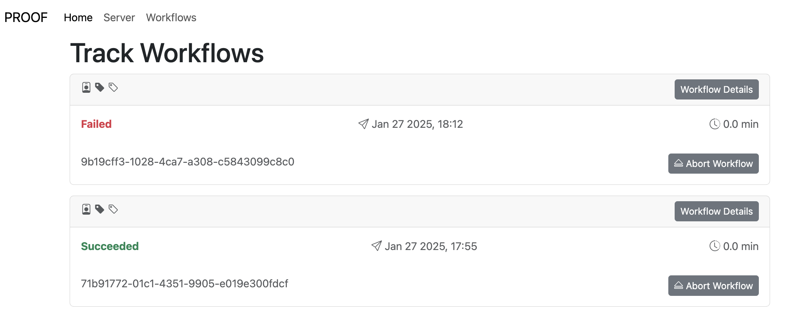

## Web Frameworks

Web? 

> Something (aka web application) you'll look at in a browser

Frameworks?

> A set of reusable components

## Why are we choosing?

Of immediate import is the next iteration of PROOF, and

<br>

We're likely to make more web applications down the road

## How do we choose which framework?

- Programming language(s)
- What is the community like? Can we get help (from humans, AI, docs, FH expertise, etc.)?
- Can we iterate quickly?
- Extension support
- Performance/scalability requirements
- Good for our team? (small learning curve, maintable)

## The choices

- Rails (Ruby) [rubyonrails.org](https://rubyonrails.org/)
- Svelte Kit (Javascript ) [svelte.dev/docs/kit](https://svelte.dev/docs/kit/introduction)
- HTMX [htmx.org](https://htmx.org/) / FastAPI (Python ) [github.com/fastapi/fastapi](https://github.com/fastapi/fastapi)

## The choices - 

Besides the programming language differing, they have many similarities

- All have routing support
- Can all include styling via css
- All have some kind of templating situation

Let's see what they look like ...

## Rails

HTML with Rails specific templating syntax `<%=`, `%>`

```ruby
<h1 class="font-bold text-4xl text-blue-500">
  PROOF Server
</h1>

<h2>Server Status</h2>
<% dat = fetch_hash %>
<ul>
	<li>Job Status: <%= dat["jobStatus"] %></li>
	<li>PROOF Server Start Time: <%= dat["jobStartTime"] %></li>
</ul>
```

## Svelte Kit

HTML "components" that compile to JS

```javascript
<script>
  export let data;
</script>

<section>
  <h1>PROOF Server</h1>
  <h2>Server Status</h2>
  <ul class="ul-server-status">
    <li>Job Status: {data.data.canJobStart}</li>
    <li>PROOF Server Start Time: {data.data.jobStartTime}</li>
  </ul>
</section>

<style> h1 { width: 100%;} </style>
```

## HTMX/FastAPI

HTML to do what JS would do w/o JS<br>
Templating via 3rd party libs (e.g., `mustache`)

```python
<h1>PROOF Server</h1>
<h2>Server Status</h2>
<div hx-ext="client-side-templates">
  <ul hx-get="/proof" mustache-template="job-template">
    <li>Loading job data...</li>
  </ul>

  <template id="job-template">
    <li>Job Status: {{jobStatus}}</li>
    <li>PROOF Server Start Time: {{jobStartTime}}</li>
  </template>
</div>
```

## Get your hands dirty 

I built a very minimal version of PROOF with each framework, w/ pages for:

- home
- server status
- workflow tracking

## Rails, Svelte, HTMX/FastAPI



They all look roughly like this

## Rails

Good

- All in 1 framework, very opinionated, 1 way to do things

Not so good

- Ideal if your app is backed by a user database
- Code is often "magical" - No, that's not good

## Svelte

Good

- JS is THE web language
- Very performant
- Svelte/SvelteKit built for journalists 4 ease of use

Not so good

- JS can be hard to reason about - e.g., probably spent the most time on this one
- DASL/FH not exactly a JS "shop"

## HTMX/FastAPI

Good

- It's just Python with html sprinkled in
- No JS unless we need it

Not so good

- Surely there's warts, but still exploring TBH - just started last week, could be dragons?

## Comparison

| Topic | Rails | Svelte | HTMX/FastAPI |
|---------|:-----|:------|:------|
| Lang.      | --   |   -- |  |
| Comm/Help      | --   |   -- |     |
| Iterate    | --    | -- |  |
| Ext.       | --    |  | -- |
| Perf./Scal.| --    |  |   -- |
| Our team | --    | -- |  |

## Take away


## JK, The Take Away

### HTMX/FastAPI

Mostly b/c Python 

- DASL has Python exp.
- FH has Python exp.
- Can easily find new hires with Python exp.

But, we need to check the pudding for the proof

- Rails or Svelte are also great options

## More

- Talk to me
- Notion page with notes and links: search "web app frameworks"
